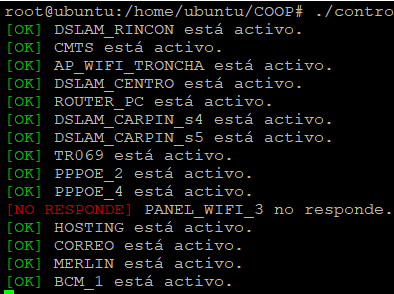
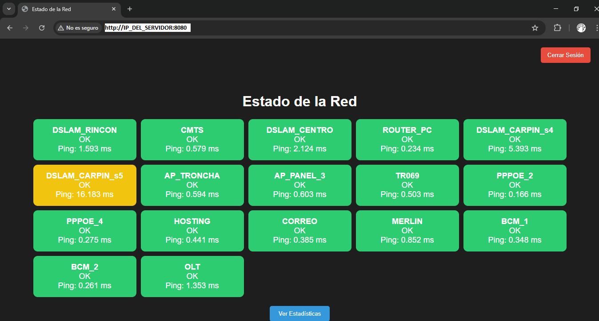

# Proyecto de Monitoreo y Alerta de Servidores

Este proyecto está diseñado para **monitorear el estado de los servidores en una red** y enviar **alertas por correo electrónico** en caso de que se detecten fallas. Está destinado a ser utilizado en un **ISP** para supervisar dispositivos críticos en la red y recibir notificaciones si algún servidor no responde.

### Funcionalidad

El sistema consiste en:
- Un **script Bash** que realiza verificaciones periódicas (ping) para determinar si los servidores están activos.
- Un **script Python** que se encarga de enviar correos electrónicos en caso de que se detecten fallas en la red.
- Un mecanismo para **evitar el envío repetitivo de correos**, enviando un correo solo si un servidor pasa de estado "OK" a "NO RESPONDE". El correo no se volverá a enviar hasta que el servidor responda al menos una vez.
- Una interfaz web para ver el el estado de todos los servidores, su ping, y y color en base a su estado (verde, amrillo y rojo)

### Tecnologías Utilizadas

- **Ubuntu Server**: Despliegue del sistema en un servidor dedicado con alimentación UPS para evitar apagones.
- **Bash**: Para la automatización de tareas de verificación de red mediante el comando `ping`.
- **Python**: Para el envío de correos electrónicos utilizando el módulo `smtplib`.
- **SMTP**: Protocolo de envío de correo electrónico.

### Requisitos del Sistema

- **Python 3** instalado en el sistema. o el `entorno virtual` "venv" creado
- **Servidor SMTP** para el envío de correos electrónicos. En este proyecto, se utiliza el servidor SMTP de Gmail.
- **Acceso a la terminal** a travez de SSH.

   El script ejecutará pings a los servidores configurados y registrará su estado en un archivo `server_status.txt`. Solo enviará un correo cuando un servidor pase de "OK" a "NO RESPONDE" y no volverá a enviar hasta que el servidor responda al menos una vez.

   

   #### Script Python (send_mail.py)

   En el archivo `send_mail.py`, deberás configurar las credenciales y los destinatarios de los correos electrónicos. Edita las siguientes variables:
 
   si no haz creado un gmail y clave, te recomiendo este [video tutorial](https://www.youtube.com/watch?v=OJxShAGAvLM)

   El script también lleva un registro de los correos enviados en `mail_log.txt` y de los errores en `error_log.txt`. El envío de correos se controlará para que no se envíen más de una vez por hora.

   El script verificará continuamente el estado de los servidores y enviará un correo si detecta un cambio en el estado. La frecuencia de verificación es de **10 segundos**, y los correos se enviarán solo si un servidor no responde durante una tolerancia definida. Por ejemplo, tengo un servidor que puede sufrir reinicios, entonces solo avisará si lleva 2 minutos sin responder.

### Interfaz Web
Para el monitoreo en tiempo real, se diseñó una interfaz web con Flask, la cual muestra los servidores a monitorear, su estado (OK, NO RESPONDE, WARNING) su valor de ping en ms, y cada recuadro se clasifica con colores, Verde, Amarillo o Rojo.
* `OK`: Se pintará de color Verde
* `NO RESPONDE`: Se pintará de color Rojo, y mostrará un cronometro del tiempo de desconexión.
* `Warning`: Se pintará de amarillo. Solo pasará cuando el ping a un servidor es alto. 
    

### Métodos Utilizados

1. **Verificación de Ping**

   El **script Bash** realiza pings a los servidores especificados para verificar su estado. Si un servidor no responde a 5 intentos de ping, se considera que está inactivo y se registra en un archivo de log.

2. **Envío de Correo con Python**

   El **script Python** se encarga de enviar un correo electrónico con la información del servidor que no responde. Utiliza el protocolo **SMTP** para conectarse a un servidor de correo (por ejemplo, Gmail). Los correos no se enviarán más de una vez por hora.

   

4. **Prevención de Spam**

   El script controla el envío de correos para que no se envíe un correo más de una vez por hora, y solo enviará un correo cuando un servidor pase de "OK" a "NO RESPONDE".

### Fortalezas

- **Automatización completa**: El monitoreo se realiza de manera continua y automática.
- **Alertas por correo electrónico**: Notifica al personal técnico en caso de fallas, lo que facilita la reacción rápida ante problemas.
- **Configuración flexible**: Permite modificar fácilmente la lista de servidores a monitorear y el intervalo de verificación.

### Debilidades

- **Dependencia del servicio SMTP**: Si el servidor SMTP falla o no es accesible, no se enviarán los correos.
- **Solo se realiza verificación de conectividad**: La detección de fallas se basa únicamente en la respuesta al ping, lo cual puede no ser suficiente para detectar otros tipos de problemas en los servidores.

### Ejemplo de Uso

En un **ISP**, este proyecto se puede utilizar para monitorear la conectividad de dispositivos clave en la red, como:

- Dslam
- Controladores de red
- Equipos de acceso
- Puntos de enlace críticos

Por ejemplo, en una configuración típica, los servidores a monitorear pueden estar dentro de la red interna, con IPs del rango **192.168.x.x** o **10.x.x.x**.

### Ejecución.

* Hay que asignar permisos `chmod +x` a todos los archivos.
* Hay que definir las credenciales, remplazando las de ejemplo del codigo. o modificando para crear un archivo serguro.
* Hay que ejecutar solo `PIPLINE_COOP.sh`

### Contribuciones

Para contribuir a este proyecto, por favor realiza un fork del repositorio y envía un pull request con tus cambios.

### Contacto
email: matiasalbertooviedogonzalez@gmail.com
